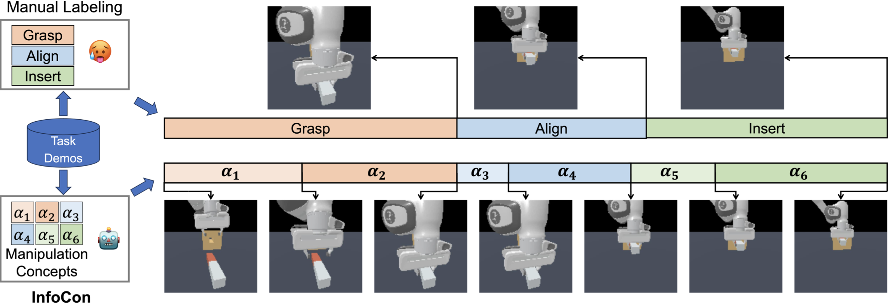

## Introduction

### Discovery of Goals as Manipulation Concepts

 
Our research endeavors to discover manipulation concepts that characterize the goal an agent aim to fulfill at a specific juncture while interacting with the environment.

When provided with a dataset comprising demonstration trajectories of manipulation tasks, we are capable of segmenting these trajectories into distinct stages and assigning each stage with a unique label derived from a learnable codebook. This codebook serves as the symbolic representation of the goals, encapsulating the manipulation concepts we aim to uncover.

### Model of Goal

There are a myriad of methods to unearth latent knowledge from data. However, the question still remains: <b>How can we ascertain that it aligns with a "goal"?</b> The essence of this inquiry is encapsulated in our understanding of <b>What constitutes a "goal"?</b>

Our research introduces two innovative concepts designed to ensure that the latent knowledge we uncover closely resembles a goal.

 

To encapsulate, the <b>Generative Goal</b> is indicative of the state that signifies the attainment of the goal.
The <b>Discriminative Goal</b> assesses the appropriateness and completeness of a goal, thereby offering directional guidance.
    
